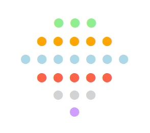

 

Osiria is a non-commercial, no-profit initiative for Natural Language Processing in Italian. Its mission is to provide developers, practitioners, and enthusiasts with top-notch models and tools for NLP tasks.

 

 

<h3>What's Osiria about?</h3>

 

<h3>🌎 📄 📊 📰 📚</h3>

 
 

Osiria is dedicated to simplifying your NLP journey. The offering includes:
 
 
<b>Applications:</b> Enjoy a wide range of pre-built NLP applications for tasks like topic modeling, information extraction, and more.
 
<b>Models:</b> Access state-of-the-art language models, fine-tuned specifically for Italian
 
<b>Resources:</b> Dive into a useful collection of tutorials, guides, and tips, which will help you hone your NLP skills

 

 

<h3>Why choose Osiria?</h3>

    
 
<b>Non-commercial & no-profit:</b> Osiria is driven by a genuine passion for NLP and the Italian language, with no ulterior motives or fees.
 
<b>For developers & enthusiasts:</b> Osiria is developed and maintained specifically for the needs of developers, practitioners, and language enthusiasts.

Stay Connected!

 
